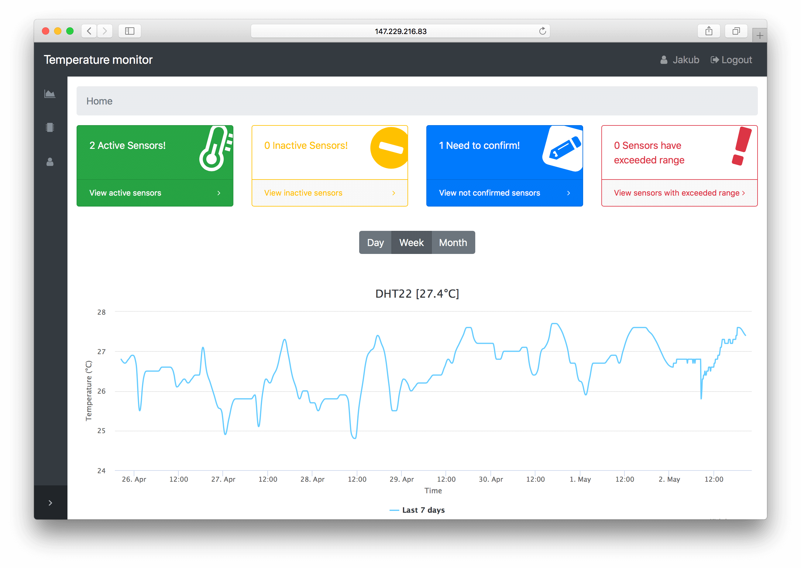

Monitoring of Temperature for Small Buildings
=============================================

<p align="center">
  
</p>

#### Abstract
The aim of this thesis is to design and implement an IoT system for monitoring the air temperature of smaller objects, e.g households. As the system is to be financially available to the wider public, it needs to be fully functional even at low procurement and operating costs\,--\,based on this requirement, it is necessary to analyze available alternatives for operating the systems. When selecting the appropriate technology for storing the acquired data, it is necessary to take into account the operations most frequently performed on the data\,--\,for this reason, a set of experiments is carried out on several types of database systems. Based on the findings gathered during analysis and experimentation, the optimal solution appears to be the combination of a generic database with web host services. In the resulting system, the sensor sends the acquired data to the server with a database, whilst the processed data is subsequently interpreted by the client-side visualizations.

Installation
------------
#### Server

Requirements:
* MariaDB
* Apache 2
* PHP >= 7.0.0
* OpenSSL PHP Extension
* PDO PHP Extension
* Mbstring PHP Extension
* Tokenizer PHP Extension
* XML PHP Extension
* Composer - Dependency Manager for PHP


Setup steps:
``` bash
# 1. move laravel folder to /var/www/html/laravel and change directory
$ mv laravel /var/www/html/laravel
$ cd /var/www/html/laravel
# 2. install dependencies
$ composer install
# 3. copy and edit enviroment file - setup credentionals to database and mailserver
$ cp .env.example .env
# 4. generate key
$ php artisan key:generate
# 5. generate database tables
$ php artisan migrate
# 6. run web application
$ php artisan serve
```

In sql folder is SQL script for creating SQL tables (in case of webhostings).

#### Sensor

Requirements:
* Arduino IDE with ESP8266 library

Setup steps:
1. open project in Arduino IDE
2. connect ESP8266 via cable to PC
3. select board in IDE
4. if it is necessery, change following rows:

``` c
#define AP_SSID "ESP"
#define AP_PASS ""
#define LED      D0
#define DHT_PIN  D1
#define BUTTON_PIN D2
#define DHT_TYPE DHT22
// #define DEBUG
```

5. add following libraries to IDE:
* Cryptosuite 2 (https://github.com/daknuett/cryptosuite2)
* DHT sensor library (https://github.com/adafruit/DHT-sensor-library)
* Adafruit Sensor (https://github.com/adafruit/Adafruit_Sensor)
6. upload program to ESP
